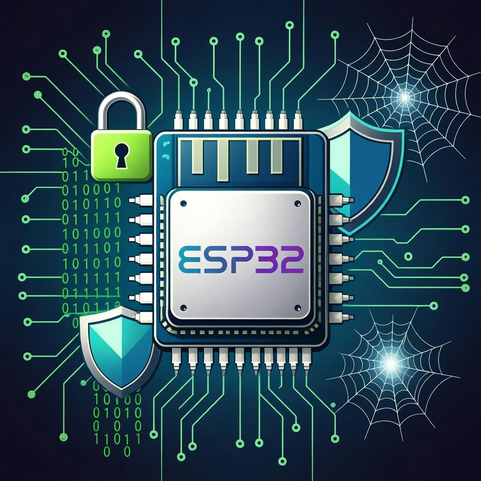

# 📡 ESP32 Wi-Fi Penetration Tool

[](https://opensource.org/licenses/MIT)
[](https://www.espressif.com/en/products/socs/esp32)
[](https://github.com/espressif/esp-idf/releases/tag/v4.1)

A professional suite for implementing and testing Wi-Fi vulnerabilities on the ESP32 platform. This tool simplifies complex 802.11 attacks, providing a robust framework for security research and educational demonstrations.

> [!CAUTION]
> **Legal Disclaimer**: This tool is for educational and authorized security testing purposes only. Using this tool against networks without explicit permission is illegal and unethical.

---

<p align="center">
    
</p>

## 🚀 Key Features

*   **🛡️ Handshake Capture**: Capture PMKIDs and full WPA/WPA2 handshakes.
*   **⚔️ Advanced Attacks**: Deauthentication, Rogue AP, and Denial of Service (DoS).
*   **📊 Traffic Analysis**: Format captured data into **PCAP** for Wireshark.
*   **🔓 Cracking Ready**: Export to **HCCAPX** for seamless integration with Hashcat.
*   **📱 Management UI**: Fully responsive web interface for control on-the-go.
*   **🧩 Extensible Architecture**: Easily add new attack modules and functionality.

---

## ⚡ Quick Start

### 1. Build and Flash
Ensure you have the [ESP-IDF 4.1](https://docs.espressif.com/projects/esp-idf/en/v4.1/get-started/index.html) environment setup.

```shell
idf.py build
idf.py flash
```

### 2. Connect
Once flashed, the ESP32 will start a Management Access Point:
- **SSID**: `Twin`
- **Password**: `Twin3141`

### 3. Configure
Open your browser and navigate to `http://192.168.4.1` to access the control dashboard.

<p align="center">
    
</p>

---

## 🛠️ Hardware Requirements

Recommended hardware for optimal performance:
- **ESP32-WROOM-32** Module (DevKitC recommended)
- **Power**: 3.7V Li-Pol battery for portable use.
- **Portability**: The entire setup can weigh as little as 17g!

| Component | Approx. Cost |
| :--- | :--- |
| ESP32 DevKit | ~$8.00 |
| 220mAh Li-Pol | ~$3.00 |
| Support Components | ~$1.00 |
| **Total** | **~$12.00** |

---

## 📖 Component Overview

| Component | Description |
| :--- | :--- |
| [**Main**](main) | Entry point & initialisation logic. |
| [**Wifi Controller**](components/wifi_controller) | Core Wi-Fi operations (AP, STA, Scan). |
| [**Webserver**](components/webserver) | Modern interface for attack configuration. |
| [**WSL Bypasser**](components/wsl_bypasser) | Bypasses stack restrictions for arbitrary frames. |
| [**Frame Analyzer**](components/frame_analyzer) | Real-time packet parsing and processing. |

---

## 📚 Documentation


## ⚖️ License
This project is licensed under the **MIT License**. See the [LICENSE](LICENSE) file for details.